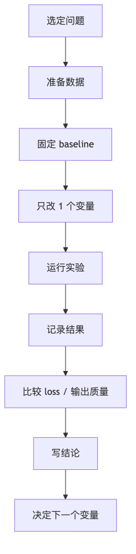

# 本地 Demo 与工作流

这个目录不是要重新实现一个大模型框架，而是把“适合本地学习”的最小实验路径整理成可直接执行的对照清单。

## 目录内容

- [01-Mac-环境自检.md](01-Mac-环境自检.md)
- [02-minbpe-tokenizer-demo.md](02-minbpe-tokenizer-demo.md)
- [03-microgpt-最小闭环-demo.md](03-microgpt-最小闭环-demo.md)
- [04-nanogpt-tinyshakespeare-demo.md](04-nanogpt-tinyshakespeare-demo.md)
- [05-采样参数对照-demo.md](05-采样参数对照-demo.md)

## 推荐顺序

1. 先做环境自检
2. 再做 tokenizer
3. 再跑最小 GPT
4. 再做轻量训练
5. 最后做采样对照实验

## 可视化工作流

## 实验记录建议

每做完一个 demo，回到：

- [01-学习会话记录模板](../notes/01-学习会话记录模板.md)
- [02-实验记录索引](../notes/02-实验记录索引.md)

把本次实验记录下来，否则后面很难横向比较。

