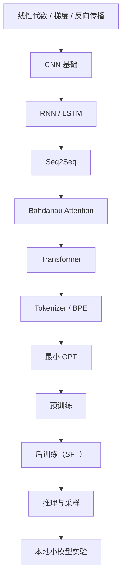
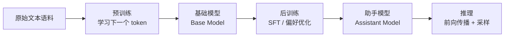
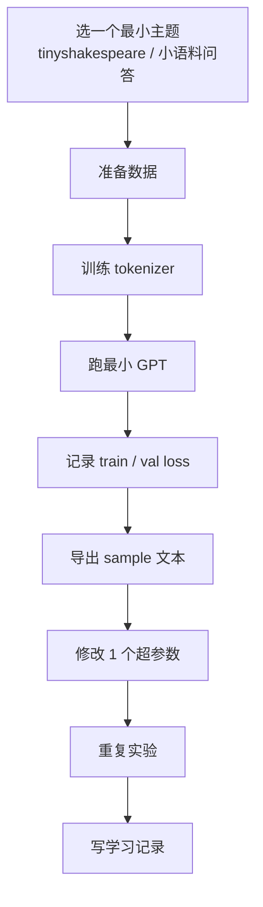

---
tags:
  - AI
  - LLM
  - Transformer
  - GPT
  - Obsidian
created: 2026-04-19
updated: 2026-04-19
---

# Transformer / GPT 从零到本地实战学习计划

> 适用设备：Apple Silicon MacBook Pro，`M5 Pro + 24GB` 统一内存  
> 学习目标：从零理解 `RNN -> Attention -> Transformer -> GPT -> 预训练 -> 后训练 -> 推理` 的完整链路，并在本地完成一套小型可运行 demo

## 这份笔记怎么用

- 先按下面的 **阶段路线** 学，不要一开始就冲大模型训练。
- 每学完一个阶段，就新建一条会话记录，使用 [[01-学习会话记录模板]]。
- 实验统一回写到 [[02-实验记录索引]]。
- 论文主线统一参考 [[03-论文阅读索引-Transformer-GPT]]。
- 每个阶段都分成三层：
  - `先看直觉`
  - `再读论文/教程`
  - `最后在本地跑代码`
- 这份计划完整覆盖三种模型工作状态：
  - `预训练（Pretraining）`
  - `后训练（Post-training，先以 SFT 为主，DPO 作为扩展）`
  - `推理（Inference）`

## 学习总路径



## 模型三种工作状态



### 1. 预训练

- 核心目标：让模型学会语言分布。
- 典型目标函数：

$$
P(x_{1:T})=\prod_{t=1}^{T} P(x_t \mid x_{1:t-1})
$$

- 你可以把它理解成：模型不断做“根据前文预测下一个 token”。

### 2. 后训练

- 核心目标：让模型“更像一个有用的助手”，而不是只会续写文本。
- 当前主线先覆盖：
  - `SFT`：监督微调
  - `DPO`：偏好优化，作为扩展阅读
- 对你现在这条学习路径来说，先把 `SFT` 吃透最重要。

### 3. 推理

- 核心目标：用训练好的参数做前向计算，逐 token 生成输出。
- 推理阶段**不更新参数**，只做：
  - tokenization
  - embedding
  - attention / MLP 前向传播
  - logits -> softmax
  - temperature / top-k / top-p 采样

---

# 0. Mac 本地环境

## 0.1 先准备工具

- Apple 官方 Mac + PyTorch MPS 说明：
  [Accelerated PyTorch training on Mac](https://developer.apple.com/metal/pytorch/)
- PyTorch 官方 MPS 文档：
  [MPS backend](https://docs.pytorch.org/docs/stable/notes/mps)
- `uv` 官方文档：
  [Astral uv](https://docs.astral.sh/uv/)
- `uv` 安装页：
  [Installation](https://docs.astral.sh/uv/getting-started/installation/)

## 0.2 推荐安装命令

```bash
xcode-select --install
curl -LsSf https://astral.sh/uv/install.sh | sh
uv python install 3.11
mkdir -p ~/llm-lab && cd ~/llm-lab
uv venv --python 3.11
source .venv/bin/activate
uv pip install torch torchvision torchaudio jupyter matplotlib numpy pandas sentencepiece tiktoken notebook
```

## 0.3 验证 MPS

```python
import torch

print("MPS available:", torch.backends.mps.is_available())
if torch.backends.mps.is_available():
    x = torch.ones(3, device="mps")
    print(x)
```

## 0.4 本地学习目录建议

```text
~/llm-lab/
  repos/
    minbpe/
    LLMs-from-scratch/
    nanoGPT/
    build-nanogpt/
  runs/
    tinyshakespeare/
    tokenizer/
    experiments/
  notes/
    screenshots/
    loss-curves/
```

---

# 1. Attention 之前必须补的知识

## 1.1 数学和神经网络最小前置

### 必须掌握

- 向量、矩阵乘法
- 导数、链式法则
- 梯度下降
- 反向传播
- softmax
- 交叉熵

### 推荐资源

- [CS231n 课程主页](https://cs231n.github.io/)
- [CS231n Neural Networks Part 2](https://cs231n.github.io/neural-networks-2/)
- [3Blue1Brown: Neural Networks](https://www.3blue1brown.com/topics/neural-networks)

### 最重要的两个公式

softmax：

$$
\mathrm{softmax}(z_i)=\frac{e^{z_i}}{\sum_j e^{z_j}}
$$

语言模型里的负对数似然 / 交叉熵：

$$
\mathcal{L}=-\log P(x_t \mid x_{1:t-1})
$$

### 本阶段交付物

- 能用自己的话解释 `logits -> softmax -> 概率 -> loss`
- 能解释为什么训练目标是“让正确 token 的概率更高”

## 1.2 CNN 基础

### 为什么要补 CNN

- 不是因为 GPT 会直接用 CNN。
- 而是因为 Transformer 论文的历史意义之一，就是“摆脱了卷积和循环结构”。
- 如果不知道 CNN 和 RNN 在解决什么问题，就很难真正理解 Transformer 为什么重要。

### 推荐资源

- [CS231n Convolutional Networks](https://cs231n.github.io/convolutional-networks/)
- [CS231n Deep Learning for Computer Vision](https://cs231n.stanford.edu/)

### 至少要知道的概念

- 局部感受野
- 权重共享
- 卷积核
- 池化
- CNN 为什么擅长图像

### 本阶段交付物

- 能回答：`CNN 为什么天然适合二维局部结构，而不适合一般长文本序列建模？`

## 1.3 RNN / LSTM 基础

### 为什么这是 Attention 的真正前置

- 最早的 attention 不是和 Transformer 一起凭空出现的。
- 它最早是为了解决 `RNN seq2seq` 的信息瓶颈问题。

### 推荐资源

- [CS231n Recurrent Neural Networks](https://cs231n.github.io/rnn/)
- [Understanding LSTM Networks](https://research.google/pubs/understanding-lstm-networks/)
- [The Unreasonable Effectiveness of Recurrent Neural Networks](https://karpathy.github.io/2015/05/21/rnn-effectiveness/)

### 必须看懂的递推形式

$$
h_t = f_W(h_{t-1}, x_t)
$$

### LSTM 只需要先懂直觉

$$
c_t = f_t \odot c_{t-1} + i_t \odot \tilde{c}_t
$$

你现在不必推完整细节，但要知道：

- `h_t` 是当前隐藏状态
- `c_t` 是更稳定的长期记忆通道
- 门控结构是在缓解长距离依赖和梯度问题

### 本阶段交付物

- 能回答：`为什么 RNN 天然按时间顺序处理序列？`
- 能回答：`为什么 RNN 在长依赖上容易困难？`

## 1.4 Seq2Seq 和 Attention 出现的历史动机

### 必读论文

- [Sequence to Sequence Learning with Neural Networks](https://arxiv.org/abs/1409.3215)
- [Neural Machine Translation by Jointly Learning to Align and Translate](https://arxiv.org/abs/1409.0473)

### 你要抓住的主线

- `seq2seq`：把输入句子压成固定长度向量，再由 decoder 生成输出
- 问题：长句子时，固定长度向量容易成为瓶颈
- `Bahdanau attention`：不再只依赖一个固定向量，而是在生成每个目标 token 时，动态查看源句子的相关部分

### 本阶段交付物

- 能回答：`Attention 最早是为了解决什么瓶颈？`
- 能解释“soft alignment”的直觉意义

---

# 2. Transformer 本体

## 2.1 先看直觉解释

- [Transformer Explainer](https://poloclub.github.io/transformer-explainer/)
- [Transformer Explainer GitHub](https://github.com/poloclub/transformer-explainer)
- [The Illustrated Transformer](https://jalammar.github.io/illustrated-transformer/)
- [3Blue1Brown: Attention in transformers](https://www.3blue1brown.com/lessons/attention)

### 先观察什么

- token 间如何互相“看见”
- attention map 为什么不是固定的
- temperature / top-k / top-p 如何影响输出

## 2.2 原始论文

- [Attention Is All You Need](https://arxiv.org/abs/1706.03762)

### 最关键公式

$$
\mathrm{Attention}(Q,K,V)=\mathrm{softmax}\left(\frac{QK^\top}{\sqrt{d_k}}\right)V
$$

### 一定要理解的物理直觉

- `Q`：我现在想找什么
- `K`：每个 token 能提供什么索引线索
- `V`：真正被取出来的信息内容
- `QK^T`：相似度或匹配分数
- `1 / \sqrt{d_k}`：做缩放，避免 softmax 进入过陡区间
- softmax 后的结果：每个 token 对其他 token 的关注权重

## 2.3 配套代码阅读

### 推荐仓库

- [harvardnlp/annotated-transformer](https://github.com/harvardnlp/annotated-transformer)
- [The Annotated Transformer 在线版](https://nlp.seas.harvard.edu/annotated-transformer)
- [a-PyTorch-Tutorial-to-Transformers](https://github.com/sgrvinod/a-PyTorch-Tutorial-to-Transformers)
- [gordicaleksa/pytorch-original-transformer](https://github.com/gordicaleksa/pytorch-original-transformer)

### 读代码时重点盯住

- embedding
- positional encoding
- multi-head attention
- residual connection
- layer norm
- FFN
- mask

### FFN 的基本形式

$$
\mathrm{FFN}(x)=\max(0, xW_1+b_1)W_2+b_2
$$

### 本阶段交付物

- 能解释为什么 Transformer 不需要 recurrence
- 能解释为什么必须显式加入位置信息
- 能看懂一个最小 Transformer block 的前向流程

---

# 3. Tokenizer 和最小 GPT

## 3.1 Tokenizer

### 推荐仓库

- [karpathy/minbpe](https://github.com/karpathy/minbpe)

### 要点

- 不能直接用“词”做词表
- 字符级过长
- 词级过大且 OOV 严重
- BPE 是在“词表大小”和“序列长度”之间做折中

### 本地建议

```bash
cd ~/llm-lab/repos
git clone https://github.com/karpathy/minbpe.git
cd minbpe
python -m venv .venv
source .venv/bin/activate
pip install -e .
```

### 本阶段交付物

- 自己训练一个极小 BPE tokenizer
- 记录 `vocab size` 变化如何影响 token 长度

## 3.2 最小 GPT

### 推荐资源

- [microgpt 在线版](https://karpathy.ai/microgpt.html)
- [microgpt 源码 gist](https://gist.github.com/karpathy/8627fe009c40f57531cb18360106ce95)

### 这一阶段的目标

- 不是要得到强模型
- 是要把“GPT 的最小闭环”完整看清楚

### 你要跟着看通的链路

- 原始文本
- tokenizer
- token ids
- token embedding + positional embedding
- attention / MLP
- logits
- softmax
- loss
- backward
- Adam 更新
- 采样生成

### 本阶段交付物

- 能指出源码中哪一段在做：
  - attention
  - loss
  - optimizer
  - sampling

---

# 4. GPT、预训练和规模规律

## 4.1 GPT-1：预训练范式出现

- [Improving Language Understanding by Generative Pre-Training](https://cdn.openai.com/research-covers/language-unsupervised/language_understanding_paper.pdf)
- [GPT-1 官方代码仓库](https://github.com/openai/finetune-transformer-lm)

### 这一篇要抓住什么

- 先在无标注大语料上做语言模型预训练
- 再在具体任务上做微调
- 这是现代“预训练 + 下游适配”范式的关键起点

## 4.2 GPT-2：zero-shot / scaling 的味道开始出现

- [Language Models are Unsupervised Multitask Learners](https://cdn.openai.com/better-language-models/language-models.pdf)
- [openai/gpt-2](https://github.com/openai/gpt-2)

### 这一篇要抓住什么

- 单纯 next-token prediction 目标，在规模上去之后，会出现跨任务迁移能力
- GPT-2 让“语言模型本身就是多任务接口”这个直觉开始清晰起来

## 4.3 Scaling Laws

- [Scaling Laws for Neural Language Models](https://arxiv.org/abs/2001.08361)

### 这一篇要抓住什么

- loss 和参数量、数据量、计算量之间近似服从幂律关系
- 这会帮助你从“玄学调参”转向“规模感知调参”

### 本阶段交付物

- 能回答：`为什么更大的模型、更大的数据、更长的训练常常会更好？`
- 能回答：`为什么不是只改宽度/深度就够了？`

---

# 5. 主教材仓库：从 scratch 到可训练 GPT

## 推荐主线

- [rasbt/LLMs-from-scratch](https://github.com/rasbt/LLMs-from-scratch)

## 建议顺序

1. `Ch 2: Working with Text Data`
2. `Ch 3: Coding Attention Mechanisms`
3. `Ch 4: Implementing a GPT Model from Scratch`
4. `Ch 5: Pretraining on Unlabeled Data`
5. `Ch 7: Finetuning to Follow Instructions`

## 为什么这套最适合作为主线

- 章节化非常清晰
- notebook 友好
- 既讲原理也讲实现
- 不止停留在“最小玩具”，而是覆盖到 `pretrain -> instruction tuning`

## 本地建议

```bash
cd ~/llm-lab/repos
git clone https://github.com/rasbt/LLMs-from-scratch.git
cd LLMs-from-scratch
uv venv --python 3.11
source .venv/bin/activate
uv pip install -r requirements.txt
```

### 本阶段交付物

- 跑通 `attention`
- 跑通 `GPT from scratch`
- 跑通一个最小 `pretraining`
- 跑通一个最小 `instruction finetuning`

---

# 6. Karpathy 工程线：build-nanogpt / nanoGPT / nanochat

## 6.1 build-nanogpt

- [karpathy/build-nanogpt](https://github.com/karpathy/build-nanogpt)

### 作用

- 适合看“从空文件一路搭到 GPT-2 风格实现”的过程
- 更像逐步讲解版

## 6.2 nanoGPT

- [karpathy/nanoGPT](https://github.com/karpathy/nanoGPT)

### 作用

- 最小可训练 GPT 工程基线
- 很适合做本地小实验

### 你的机器建议只做小规模配置

- `block_size=64 / 128 / 256`
- `n_layer=4~6`
- `n_head=4~6`
- `n_embd=128~384`
- 先从 `tinyshakespeare` 级语料开始

## 6.3 nanochat

- [karpathy/nanochat](https://github.com/karpathy/nanochat)

### 作用

- 适合理解“从基础模型到可对话系统”的完整链路
- 覆盖 tokenization、pretraining、finetuning、evaluation、inference、web serving

### 说明

- 这个仓库更接近“ChatGPT 风格系统”，但不适合当第一站
- 它更适合你在前面主线走通后，拿来建立系统级全貌

---

# 7. 后训练：先学 SFT，再看 DPO

## 7.1 先学 SFT

### 主线资源

- [LLMs-from-scratch](https://github.com/rasbt/LLMs-from-scratch) `Ch 7`

### 要点

- 把“指令 -> 回答”的监督样本喂给模型
- 目标仍然是 token 级预测
- 只是训练数据从“通用续写文本”变成了“符合助手行为的数据”

### 本阶段交付物

- 能解释为什么 SFT 还是语言建模，只是数据分布变了

## 7.2 DPO 作为扩展

- [Direct Preference Optimization](https://arxiv.org/abs/2305.18290)

### 要点

- 用偏好对数据对模型进行优化
- 相比完整 RLHF，路径更直接
- 你当前不必先自己实现，只要先建立概念地图

### 本阶段交付物

- 能回答：`SFT 解决了什么，DPO 又是在补什么？`

---

# 8. 推理阶段：模型训好之后到底怎么工作

## 8.1 核心直觉

- 参数已经冻结
- 每一步都只做前向传播
- 当前 token 和上下文经过网络，得到下一 token 的 logits
- 再用采样策略选出一个 token，追加到上下文中
- 重复直到停止

## 8.2 推荐资源

- [Transformer Explainer](https://poloclub.github.io/transformer-explainer/)
- [nanoGPT](https://github.com/karpathy/nanoGPT)
- [nanochat](https://github.com/karpathy/nanochat)

## 8.3 你必须会解释的概念

- greedy decoding
- temperature
- top-k
- top-p
- KV cache 的直觉意义

## 8.4 采样阶段最常用的观察实验

- 固定 prompt，比较 `temperature=0.3 / 0.8 / 1.2`
- 固定 prompt，比较 `top-k=20 / 50 / 100`
- 固定 prompt，比较 `top-p=0.8 / 0.9 / 0.95`

### 本阶段交付物

- 能回答：`为什么推理阶段不需要反向传播？`
- 能回答：`为什么 temperature 会影响“创造性”？`

---

# 9. 本地代码 demo 工作流



## 推荐最小 demo 顺序

1. `minbpe` 训练一个极小 tokenizer  
2. `microgpt` 看通最小 GPT 闭环  
3. `LLMs-from-scratch` 跑 attention + GPT from scratch  
4. `nanoGPT` 在 `tinyshakespeare` 上做小训练  
5. 用固定 prompt 对比采样参数  

## 每次 demo 都要留下的记录

- 语料是什么
- 模型配置是什么
- 训练步数是多少
- train loss / val loss 分别是多少
- 采样输出看起来像什么
- 这次改动的唯一变量是什么

---

# 10. 推荐的实验矩阵

## 第一组：学习率

- `1e-4`
- `3e-4`
- `1e-3`

观察：

- loss 是否震荡
- 是否出现不稳定
- 生成文本是否快速退化

## 第二组：上下文长度

- `64`
- `128`
- `256`

观察：

- 训练速度
- 显存/内存压力
- 对长依赖的改善

## 第三组：模型深度

- `4 layers`
- `6 layers`

观察：

- 表达能力是否提升
- 是否更容易过拟合

## 第四组：tokenizer 方案

- char-level
- BPE-level

观察：

- 序列长度变化
- loss 变化
- 输出文本连贯性

## 第五组：采样参数

- temperature
- top-k
- top-p

观察：

- 输出是否更保守
- 输出是否更发散
- 幻觉和重复是否变多

---

# 11. 按周推进版

## 第 1 周：神经网络 / 反向传播 / softmax / 交叉熵

- 看：
  - [CS231n](https://cs231n.github.io/)
  - [CS231n Neural Networks Part 2](https://cs231n.github.io/neural-networks-2/)
- 目标：
  - 搞懂 loss、梯度、优化

## 第 2 周：CNN + RNN + LSTM

- 看：
  - [CS231n Convolutional Networks](https://cs231n.github.io/convolutional-networks/)
  - [CS231n RNN](https://cs231n.github.io/rnn/)
  - [Understanding LSTM Networks](https://research.google/pubs/understanding-lstm-networks/)
- 目标：
  - 理解 attention 出现之前的技术背景

## 第 3 周：Seq2Seq + Bahdanau Attention

- 看：
  - [Sequence to Sequence Learning with Neural Networks](https://arxiv.org/abs/1409.3215)
  - [Neural Machine Translation by Jointly Learning to Align and Translate](https://arxiv.org/abs/1409.0473)
- 目标：
  - 明白 attention 的历史动机

## 第 4 周：Transformer 论文和可视化

- 看：
  - [Attention Is All You Need](https://arxiv.org/abs/1706.03762)
  - [Transformer Explainer](https://poloclub.github.io/transformer-explainer/)
  - [The Illustrated Transformer](https://jalammar.github.io/illustrated-transformer/)
- 目标：
  - 吃透 Q/K/V 和 self-attention

## 第 5 周：Tokenizer + 最小 GPT

- 看：
  - [karpathy/minbpe](https://github.com/karpathy/minbpe)
  - [microgpt](https://karpathy.ai/microgpt.html)
- 目标：
  - 看清 GPT 最小闭环

## 第 6 周：LLMs-from-scratch 主线

- 看：
  - [rasbt/LLMs-from-scratch](https://github.com/rasbt/LLMs-from-scratch)
- 目标：
  - 跑通 `attention -> GPT -> pretraining`

## 第 7 周：SFT 和推理

- 看：
  - [LLMs-from-scratch](https://github.com/rasbt/LLMs-from-scratch) `Ch 7`
  - [Transformer Explainer](https://poloclub.github.io/transformer-explainer/)
- 目标：
  - 把 `后训练` 和 `推理` 串起来

## 第 8 周：nanoGPT / nanochat 系统视角

- 看：
  - [karpathy/build-nanogpt](https://github.com/karpathy/build-nanogpt)
  - [karpathy/nanoGPT](https://github.com/karpathy/nanoGPT)
  - [karpathy/nanochat](https://github.com/karpathy/nanochat)
- 目标：
  - 建立完整工程全貌

---

# 12. 每个阶段结束时的自测问题

## RNN 之后

- 为什么 RNN 要按时间顺序处理？
- 为什么长依赖容易困难？

## Attention 之后

- `Q/K/V` 分别表示什么？
- 为什么要除以 `\sqrt{d_k}`？

## Transformer 之后

- 为什么 Transformer 没有 recurrence 也能处理序列？
- 为什么一定要加入位置编码？

## GPT 之后

- decoder-only 和原始 encoder-decoder Transformer 的差异是什么？
- causal mask 解决了什么问题？

## 预训练之后

- 为什么 next-token prediction 会学到广义能力？
- loss 和规模之间为什么会有幂律关系？

## 后训练之后

- SFT 与预训练的数据目标差异是什么？
- DPO 相比 SFT 补了什么？

## 推理之后

- 为什么推理不更新参数？
- 为什么不同采样策略会显著改变输出风格？

---

# 13. 下一步怎么执行

- 从第 1 周开始，按顺序推进。
- 每次学习开一个新页面，使用 [[01-学习会话记录模板]]。
- 每做完一个本地实验，就把命令、配置和 sample 贴回 Obsidian。
- 遇到不懂的公式，优先回到：
  - [CS231n](https://cs231n.github.io/)
  - [Transformer Explainer](https://poloclub.github.io/transformer-explainer/)
  - [LLMs-from-scratch](https://github.com/rasbt/LLMs-from-scratch)

## 建议你第一个真正执行的动作

1. 安装 `uv` 和 PyTorch MPS  
2. 打开 [Transformer Explainer](https://poloclub.github.io/transformer-explainer/) 玩 20 分钟  
3. 阅读 [CS231n RNN](https://cs231n.github.io/rnn/)  
4. 新建一条学习记录，回答：
   - RNN 的时间递推是什么？
   - seq2seq 的固定向量瓶颈是什么？
   - attention 为什么会出现？

## 对照资料

- 论文阅读地图：[[03-论文阅读索引-Transformer-GPT]]
- 本地 demo 目录：仓库中的 `examples/`
