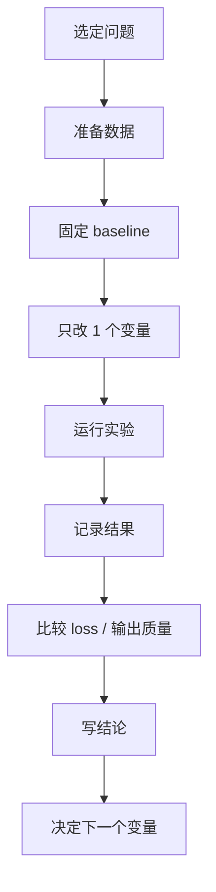

---
tags:
  - 实验
  - 索引
  - LLM
  - GPT
created: 2026-04-19
updated: 2026-04-19
---

# 实验记录索引

> 配合 [[00-总览-Transformer-GPT-本地学习计划]] 和 [[01-学习会话记录模板]] 使用

补充：

- 论文主线请参考 [[03-论文阅读索引-Transformer-GPT]]

## 这个页面的用途

- 汇总所有本地实验，避免实验越做越多之后找不到历史记录。
- 用同一套字段记录模型、数据、参数、loss、sample 质量和结论。
- 帮助把“看论文的理解”转成“能比较、能复现、能总结”的实验链路。

## 实验主工作流



## 记录原则

- 一次实验只改一个主要变量。
- 先保留一个稳定 baseline，再做派生实验。
- 每条实验都必须留下：
  - 日期
  - 仓库
  - 数据集
  - 关键参数
  - train / val loss
  - sample 输出摘要
  - 本次结论

## 推荐实验编号规则

- `EXP-001`
- `EXP-002`
- `EXP-003`

如果是某个 baseline 的分支实验，可以记成：

- `EXP-003A`
- `EXP-003B`

## 状态看板

| 编号 | 日期 | 阶段 | 仓库 | 主题 | 主要变量 | 状态 | 结论一句话 |
| --- | --- | --- | --- | --- | --- | --- | --- |
| EXP-001 |  | tokenizer |  |  |  | planned |  |
| EXP-002 |  | microgpt |  |  |  | planned |  |
| EXP-003 |  | attention |  |  |  | planned |  |
| EXP-004 |  | pretraining |  |  |  | planned |  |
| EXP-005 |  | inference |  |  |  | planned |  |

状态建议：

- `planned`
- `running`
- `done`
- `needs-rerun`

## 优先实验清单

### 第一组：Tokenizer

1. `vocab size` 对序列长度的影响
2. char-level 和 BPE-level 的对比
3. 小语料下 BPE merge 的效果观察

### 第二组：最小 GPT

1. `block_size=64 / 128 / 256`
2. `n_layer=4 / 6`
3. `n_embd=128 / 256 / 384`

### 第三组：训练稳定性

1. `learning_rate=1e-4 / 3e-4 / 1e-3`
2. 是否使用 weight decay
3. batch size 改变后的 loss 波动

### 第四组：推理采样

1. `temperature=0.3 / 0.8 / 1.2`
2. `top-k=20 / 50 / 100`
3. `top-p=0.8 / 0.9 / 0.95`

## 建议目录组织

```text
experiments/
  EXP-001/
    config.md
    run.log
    samples.txt
    notes.md
  EXP-002/
    config.md
    run.log
    samples.txt
    notes.md
```

## 每条实验的最小模板

你可以为每个实验新建独立页面，使用下面的结构：

```md
# EXP-XXX 标题

- 日期：
- 仓库：
- 数据集：
- 阶段：
- 目标：

## Baseline

- 使用的基线配置：

## 本次唯一变量

- 

## 运行命令

```bash
# command here
```

## 结果

- train loss：
- val loss：
- sample 摘要：

## 观察

- 

## 结论

- 

## 下一步

- 
```

## 实验设计提醒

- 不要一次同时改 `learning rate`、`block size`、`depth`。
- 先让模型能稳定下降，再追求 sample 质量。
- 先关注 `loss 曲线是否健康`，再评价“像不像人话”。
- 推理实验要固定 prompt，否则很难横向比较。

## 推荐 baseline 表

| 类型 | 仓库 | 数据 | 建议 baseline |
| --- | --- | --- | --- |
| tokenizer | `minbpe` | 小文本语料 | 小词表，先观察 token 长度变化 |
| 最小 GPT | `microgpt` | names / toy corpus | 先跑通完整前后向 |
| from scratch GPT | `LLMs-from-scratch` | 书中示例 | 优先按 notebook 默认值 |
| 轻量训练 | `nanoGPT` | `tinyshakespeare` | 小层数、小 embedding、小 block size |
| 推理对比 | `nanoGPT` 或 `nanochat` | 固定 prompt | 只改采样参数 |

## 你现在最值得先填的 3 条实验

1. `EXP-001`：`minbpe` 小 tokenizer 实验  
2. `EXP-002`：`microgpt` 最小闭环跑通  
3. `EXP-003`：`nanoGPT` 在 `tinyshakespeare` 上做一个 baseline 小训练  
