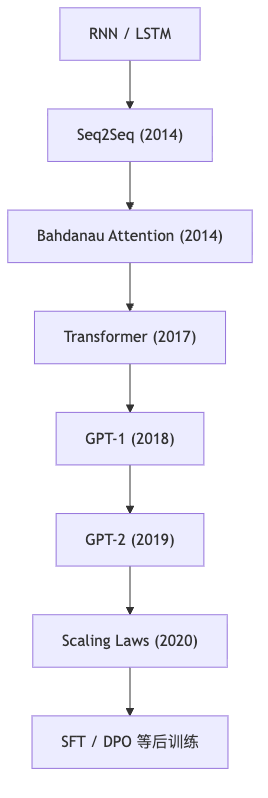
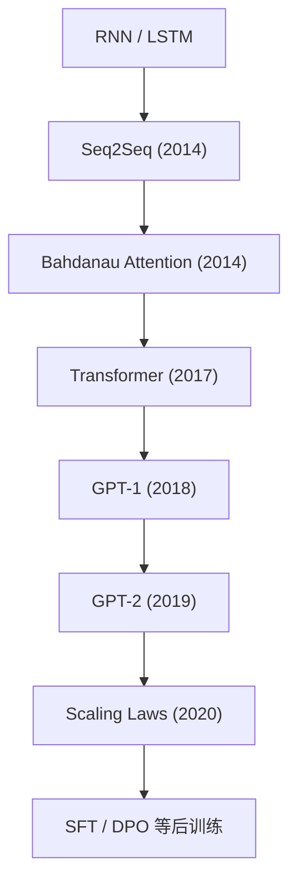

---
tags:
  - 论文
  - 阅读索引
  - Transformer
  - GPT
created: 2026-04-19
updated: 2026-04-19
---

# 论文阅读索引：Transformer / GPT 主线

> 目标：把 `RNN / Seq2Seq / Attention / Transformer / GPT / Scaling / 后训练` 串成一条连续演化线，而不是零散读论文。

## 这份索引怎么用

- 如果你是第一次系统学，严格按“推荐顺序”走。
- 每篇论文不要追求一次全懂，优先回答“它解决了前一代方法的什么问题”。
- 每篇论文读完，最好把结论记回 [01-学习会话记录模板](01-学习会话记录模板.md)。

## 推荐顺序

1. [Sequence to Sequence Learning with Neural Networks](https://arxiv.org/abs/1409.3215)
2. [Neural Machine Translation by Jointly Learning to Align and Translate](https://arxiv.org/abs/1409.0473)
3. [Attention Is All You Need](https://arxiv.org/abs/1706.03762)
4. [Improving Language Understanding by Generative Pre-Training](https://cdn.openai.com/research-covers/language-unsupervised/language_understanding_paper.pdf)
5. [Language Models are Unsupervised Multitask Learners](https://cdn.openai.com/better-language-models/language-models.pdf)
6. [Scaling Laws for Neural Language Models](https://arxiv.org/abs/2001.08361)
7. [Direct Preference Optimization](https://arxiv.org/abs/2305.18290)

## 关系图

## 按主题阅读

### A. Seq2Seq：为什么“固定长度向量”会出问题

#### 论文

- [Sequence to Sequence Learning with Neural Networks](https://arxiv.org/abs/1409.3215)

#### 读这篇前先知道什么

- RNN 的时间递推
- LSTM 的长期记忆直觉
- 编码器 / 解码器的基本概念

#### 读完要能回答

- seq2seq 是怎么把一个序列映射成另一个序列的？
- 为什么把整句压成一个固定向量会形成瓶颈？
- 为什么长句子更容易受影响？

#### 配套代码/材料

- [CS231n RNN](https://cs231n.github.io/rnn/)
- [Understanding LSTM Networks](https://research.google/pubs/understanding-lstm-networks/)

### B. Attention：它最初到底在修什么问题

#### 论文

- [Neural Machine Translation by Jointly Learning to Align and Translate](https://arxiv.org/abs/1409.0473)

#### 核心问题

- 不是“提出了 Transformer”
- 而是解决 `seq2seq` 中“固定长度表示不够用”的问题

#### 读完要能回答

- attention 最早的输入输出是什么？
- 为什么生成每个目标词时，需要动态看源句子的不同部分？
- “soft alignment” 的意义是什么？

### C. Transformer：为什么说 Attention Is All You Need

#### 论文

- [Attention Is All You Need](https://arxiv.org/abs/1706.03762)

#### 必抓公式

$$
\mathrm{Attention}(Q,K,V)=\mathrm{softmax}\left(\frac{QK^\top}{\sqrt{d_k}}\right)V
$$

#### 读完要能回答

- 为什么 Transformer 不需要 recurrence？
- 为什么 attention 需要 `Q/K/V` 三套表示？
- 为什么要除以 `\sqrt{d_k}`？
- 为什么需要位置编码？

#### 配套代码/材料

- [The Annotated Transformer](https://github.com/harvardnlp/annotated-transformer)
- [The Annotated Transformer 在线版](https://nlp.seas.harvard.edu/annotated-transformer)
- [Transformer Explainer](https://poloclub.github.io/transformer-explainer/)
- [The Illustrated Transformer](https://jalammar.github.io/illustrated-transformer/)

### D. GPT-1：预训练范式是怎么明确下来的

#### 论文

- [Improving Language Understanding by Generative Pre-Training](https://cdn.openai.com/research-covers/language-unsupervised/language_understanding_paper.pdf)

#### 读完要能回答

- GPT-1 为什么强调“先预训练，再微调”？
- 这里的预训练和传统监督学习有什么不同？
- 为什么 decoder-only 的自回归语言模型可以承载通用语言能力？

#### 配套仓库

- [openai/finetune-transformer-lm](https://github.com/openai/finetune-transformer-lm)
- [karpathy/minGPT](https://github.com/karpathy/minGPT)

### E. GPT-2：为什么只做语言建模也能跨任务泛化

#### 论文

- [Language Models are Unsupervised Multitask Learners](https://cdn.openai.com/better-language-models/language-models.pdf)

#### 读完要能回答

- 为什么 GPT-2 让“语言模型本身就是接口”这件事更明显？
- zero-shot 能力和模型规模之间是什么关系？
- 它和 GPT-1 的差异重点在哪里？

#### 配套仓库

- [openai/gpt-2](https://github.com/openai/gpt-2)
- [karpathy/nanoGPT](https://github.com/karpathy/nanoGPT)

### F. Scaling Laws：为什么现代 LLM 总在谈参数、数据和算力

#### 论文

- [Scaling Laws for Neural Language Models](https://arxiv.org/abs/2001.08361)

#### 读完要能回答

- 为什么 loss 会随规模近似幂律下降？
- 为什么单独改深度或宽度不是全部答案？
- 为什么“模型、数据、算力”三者要一起看？

### G. 后训练：为什么基础模型还不够像助手

#### 首先要先理解

- `SFT`：监督微调
- 然后再看偏好优化方法

#### 扩展论文

- [Direct Preference Optimization](https://arxiv.org/abs/2305.18290)

#### 读完要能回答

- SFT 解决了什么？
- DPO 相比 SFT 补了什么？
- 为什么“会续写文本”不等于“会当助手”？

## 论文 -> 仓库 对照表

| 主题 | 论文 | 推荐仓库 |
| --- | --- | --- |
| Seq2Seq / Attention 前史 | `Seq2Seq`、`Bahdanau Attention` | [CS231n RNN](https://cs231n.github.io/rnn/) |
| Transformer 本体 | `Attention Is All You Need` | [annotated-transformer](https://github.com/harvardnlp/annotated-transformer) |
| 可视化理解 | Transformer 论文相关 | [Transformer Explainer](https://poloclub.github.io/transformer-explainer/) |
| GPT 预训练 | GPT-1 / GPT-2 | [nanoGPT](https://github.com/karpathy/nanoGPT) |
| 从零实现 | GPT / Attention | [LLMs-from-scratch](https://github.com/rasbt/LLMs-from-scratch) |
| 最小原子实现 | GPT | [microgpt](https://karpathy.ai/microgpt.html) |
| Chat 风格全链路 | GPT + 后训练 + 推理 | [nanochat](https://github.com/karpathy/nanochat) |

## 配套建议

- 读 `Transformer` 论文时，同时开着：
  - [Transformer Explainer](https://poloclub.github.io/transformer-explainer/)
  - [The Illustrated Transformer](https://jalammar.github.io/illustrated-transformer/)
- 读 `GPT-1 / GPT-2` 时，同时开着：
  - [nanoGPT](https://github.com/karpathy/nanoGPT)
  - [LLMs-from-scratch](https://github.com/rasbt/LLMs-from-scratch)
- 读 `DPO` 时，不必先急着实现，先把概念位置摆正：它属于“后训练”。

## 最小阅读节奏

- 每周 1 到 2 篇主论文足够。
- 每篇论文至少回答 3 个问题：
  - 它解决了上一代方法的什么痛点？
  - 它的关键结构或训练范式是什么？
  - 它对今天的 GPT / ChatGPT 有什么直接影响？

